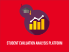

<h1 align = "center">Hi there, I’m Dezerae. </h1>

I am a cell biologist :microbe: working to uncover the molecular drivers :test_tube: of neurodegenerative diseases like Alzheimer's, Parkinson's and Motor Neuron Disease :brain:. My work has taken me to the intersection of wet-lab biology :microscope: and data science :computer:, and as a self-taught pythonista :snake: I am always looking for new things to learn  :mortar_board:. Head [here](https://dezeraecox.com/about-me/) to find out a little more about my science :woman_scientist:,  otherwise read on for more about my code creations :woman_technologist:. 

### [Publication repositories](README_complete.md/#publication-repositories)

For a detailed list of my publications, you can find my full CV [here](https://dezeraecox.com/cv-publications/). If you're more interested in the code, below are some of the open-access repositories that accompany recent manuscripts I've been involved in. 

### [Community projects](README_complete.md/#community-projects)

Outside serious science stories, I love the challenge of bringing data exploration and visualisation to new contexts using my amateur coding skills.

### [Template repositories](README_complete.md/#template-repositories)

As the lines between biology and big data blur, researchers are having to find ever-evolving best practices for organising and curating their research output. Here are some templates I use to organise my day-to-day analysis!

<h4 align = "center">That's all for now. Found something useful, or want to get in touch? You can always find me on <a href='https://twitter.com/dezeraecox'>twitter</a> or drop me an <a href='https://dezeraecox.com/contact/'>note</a>. Otherwise, thanks for stopping by!</h4>